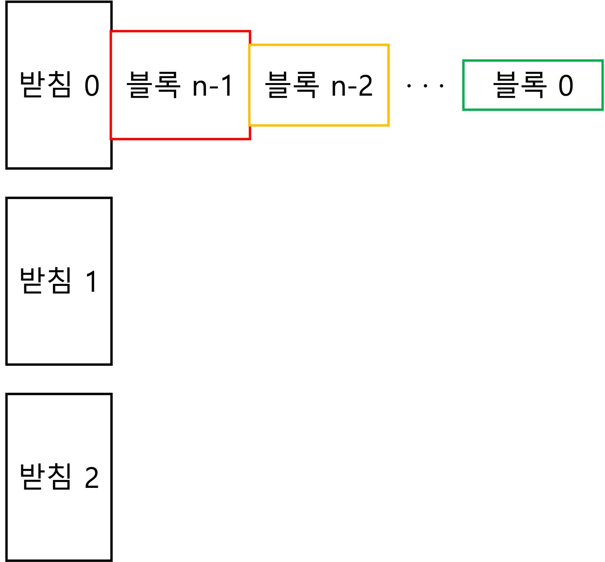

# c_class_SKU2024-01


서경대학교 C언어 강의 1분반 2024년 1학기 수업 (강좌코드: CE1001-01, EE1237-01) 홈페이지입니다.

---

### 퀴즈 안내

이번주 수업시간 (4/3) 11시 30분에 퀴즈가 있습니다.
퀴즈 문제는 산술 계산기 코드 작성 입니다.
퀴즈에 응시하지 못하신 분은 수업 당일 내로 이메일 (chaebin.kim@skuniv.ac.kr) 보내주시면 감사하겠습니다.

---

### 카톡 오픈채팅방 안내

수업 공지를 오픈채팅방에도 똑같이 전달할 예정이니 많은 참여 부탁드립니다.

참여 코드는 20240307입니다.

<picture>
  
</picture>

[https://open.kakao.com/o/ginCqweg](https://open.kakao.com/o/ginCqweg)

---

### 교과서
쉽게 풀어쓴 C언어 Express(개정4판), 천인국 저, 생능 출판사, 2023

### 평가방법
| 중간고사 | 기말고사 |  과제  |  출석  |  퀴즈  |
|:--------:|:--------:|:------:|:------:|:------:|
|  30%     |  30%     | 20%    |  10%   |  10%   | 

중간고사는 객관식 10문항, 주관식 5문항, 코딩 문제 5문항으로 출제됩니다. 
객관식 문제와 주관식 문제는 각 1점, 코딩 문제는 각 3점입니다. 
기말고사는 코딩 문제 5문항, 각 6점으로 출제됩니다. 
과제는 교과서 연습 문제 중 선정한 5 ~ 10 문제 입니다. 
출석은 출결앱의 인증번호 방식으로 진행합니다. 
퀴즈는 교과서 중간점검에서 출제됩니다.

### 객관식 문제 예시
다음 C 코드의 실행 결과를 보기에서 고르시오
```c
#include <stdio.h>

int main(void){
      char x = 'a', y = x + 1;
      printf("%c", y);
      return 0;
}
```
1) 'a' &ensp;&ensp;&ensp; 2) 'b' &ensp;&ensp;&ensp; 3) 1 &ensp;&ensp;&ensp;&ensp; 4) a &ensp;&ensp;&ensp;&ensp; 5) b

### 주관식 문제 예시

```c
#include <stdio.h>

int fib(int limit)
{
      int a = 0, b = 1;
      while(a < limit)
      {
            printf("%d ", a);
            a = a + b;
            if( /* 여기에 들어갈 코드를 입력하시오 */  ) break;
            printf("%d ", b);
            b = b + a; 
      }
}

int main(void)
{
      fib(5);
}
```
실행 결과: 0 1 1 2 3

코드: _______________

### 코딩 문제 예시

크기가 모두 다른 블록 n개가 있고, 블록을 고정시키는 받침이 3개 있습니다. 블록의 이름은 가장 작은 블록부터 크기순으로 0, 1, ..., n-1이고, 블록을 고정시키는 받침의 이름은 0, 1, 2입니다. 시작할 때 모든 블록은 받침 0에 가장 큰 블록부터 크기순으로 고정되어있습니다. 



블록은 이동할 수 있는데, 같은 받침에 고정된 블록들 중에서 가장 작은 블록만 다른 받침으로 이동할 수 있습니다. 이때 이동하려고 하는 대상인 받침에 먼저 고정되어있는 블록들 중 이동하는 블록보다 더 작은 블록이 있으면 이동을 할 수 없습니다. 고정된 블록이 하나도 없는 받침으로는 이동할 수 있습니다. 


목표는 처음에 모두 받침 0에 고정되어 있었던 블록들을 전부 받침 2로 이동하는 것입니다. 


문제: 받침 0에 고정된 n개 블록들을 모두 규칙에 따라 받침 2로 이동시키는 과정을 크기가 size로 주어진 int 배열 solution에 순서대로 저장하는 함수를 작성하시오. 이동 과정을 배열에 저장하는 순서는 블록을 빼낼 받침 번호와 뺀 블록을 넣을 받침 번호 순이고, 시간순서대로 저장합니다. 다음은 n = 1, size = 10일 때의 솔루션입니다.


다음은 n = 2, size = 10일 때의 솔루션입니다.


함수가 받는 인자는 `int n, int *solution, int size`로, n이 블록 수, solution이 이동 과정을 저장할 배열의 주소, size가 solution 배열에 할당된 크기입니다. 

```c
void hannoi(int n, int *solution, int size)
{
      // 여기에 적절한 코드를 입력해주시면 됩니다.
}
```
채점은 여러 테스트 케이스들에 대해서 통과한 개수를 기준으로 합니다.

### 공지사항
~~[2024 서경대학교 인공지능 소프트웨어 교육프로그램 학생참여](https://docs.google.com/forms/d/e/1FAIpQLScKmdb4Rlz_3jgkGzv6vrwGJlsfPAcN2HqKpEZN9Zozdyqpsw/viewform) 설문 요청드립니다~~

---
