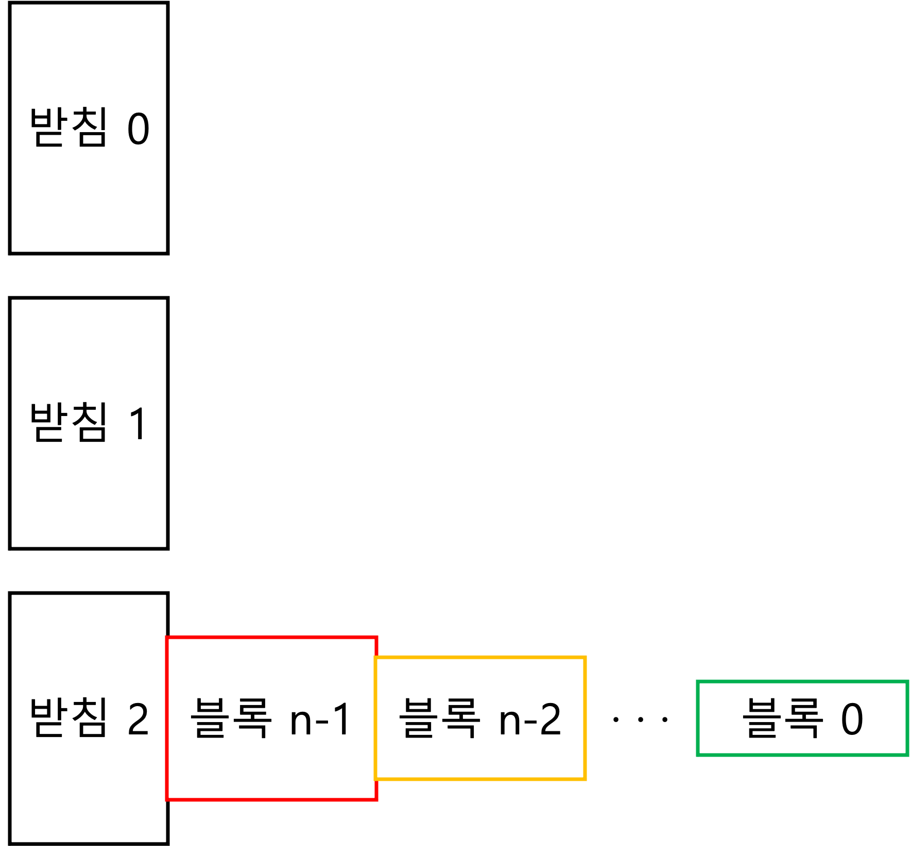

이미지 파일 모음

| 이미지 |  파일명  |  설명  |  출처  |
|:----:|:------:|:-----:|:-----:|
||The_C_Programming_Language_logo.png|C 프로그래밍 언어 로고|[위키피디아](https://en.m.wikipedia.org/wiki/File:The_C_Programming_Language_logo.svg)|
||C_qrcode.png|오픈채팅방 QR코드|
||Hannoi_start.png|코딩문제예시 설명|
||Hannoi_rule.png|코딩문제예시 설명|
||Hannoi_end.png|코딩문제예시 설명|
||Hannoi_rule.png|코딩문제예시 설명|
||Hannoi_end.png|코딩문제예시 설명|
