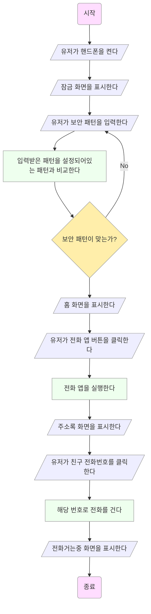
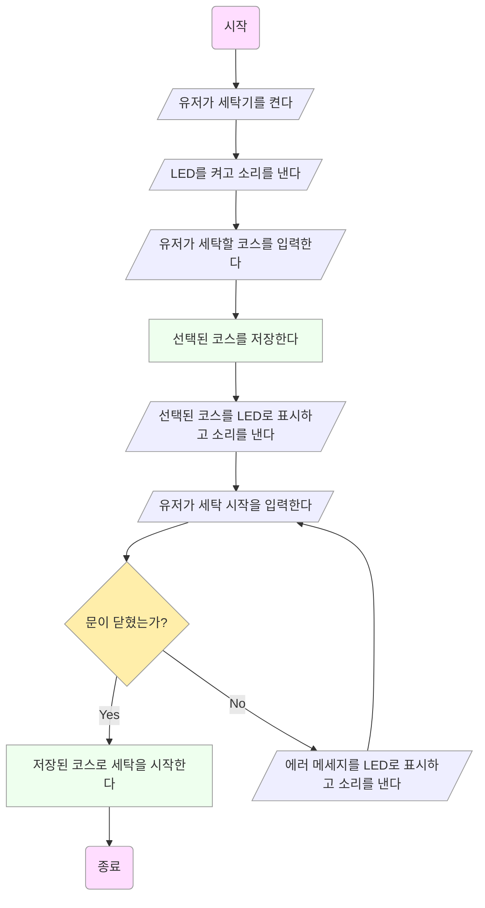
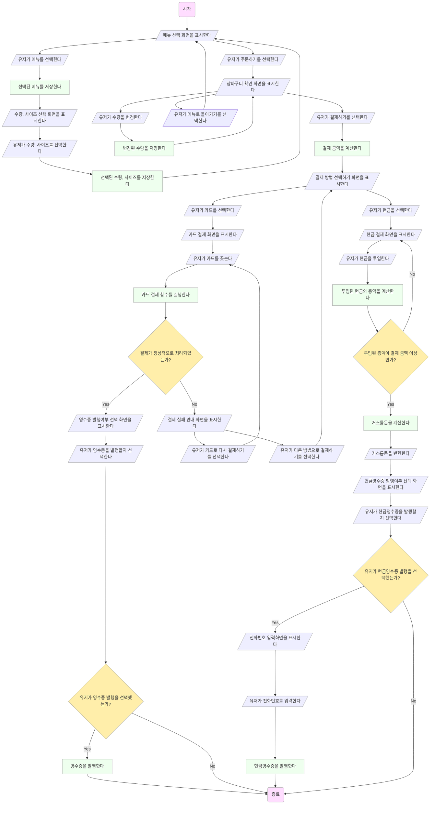

--------

## 1.1 프로그램이란?

> [!NOTE]
> 컴퓨터는 다양한 프로그램을 통해 여러 작업을 빠르고 정확하게 할 수 있습니다.
> 반면, 계산기는 프로그래밍을 할 수 없어서 특수한 작업 수행만 가능합니다.
> 프로그램 안에는 컴퓨터에게 상세하게 작업을 지시하는 명령어들이 들어있습니다.

 
 

## 1.2 프로그래밍 언어

> [!NOTE]
> 컴파일러는 프로그래밍 언어로 작성된 소스 파일을 해석해서 실행 가능한 기계어 파일을 만들어냅니다.
> 프로그래밍 언어 중 FORTRAN (포트란)은 최초의 프로그래밍 언어로 과학에서 쓰이는 계산 목적으로 만들어졌습니다.
> Python (파이썬)은 비전공자도 배우기 쉬운 언어로 인공지능, 데이터 과학에서 많이 쓰입니다.
> C++은 C에 클래스 개념이 추가되어 만들어진 언어입니다.

 

## 1.3 프로그래밍 언어

> [!NOTE]
> 임베디드 시스템은 다른 전자 제품에 내장된 컴퓨터 시스템으로 주로 장비 제어 등 특수 작업을 수행할 수 있게 최적화되어 있습니다. 
> C언어의 장점은 하드웨어 제어가 가능하고, 속도가 빠르고 메모리가 작은 프로그램을 만들 수 있다는 것입니다.
> C언어의 단점은 제어가 가능한만큼 잘못 사용하기 쉽다는 것입니다.

 

## 1.4 알고리즘이란?

1.

2.

3

 

