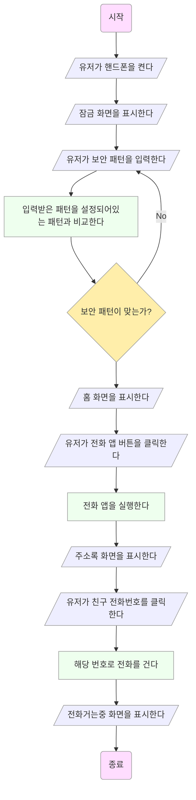
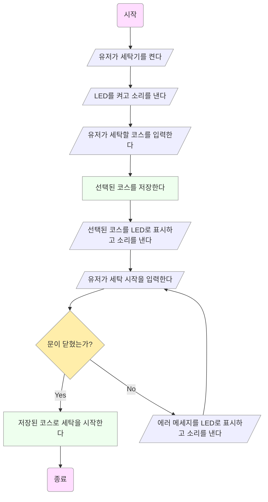
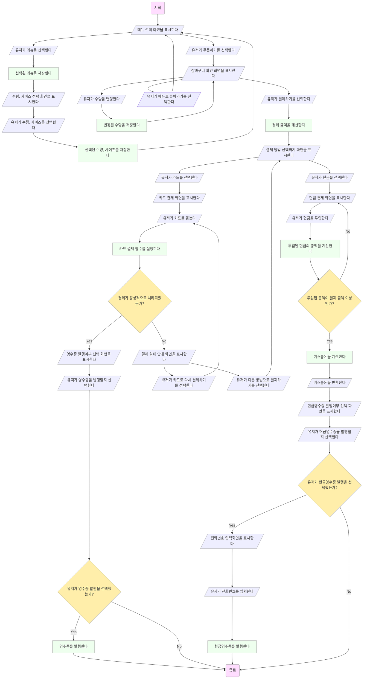

--------

## 2.1 프로그램 개발 과정

> [!NOTE]
> 프로그램 개발 과정은 먼저 프로그램의 목표와 디자인 조건을 파악하는 것입니다.
> 그리고나서 순서도나 의사코드 등의 방법으로 프로그래밍을 어떻게 할지 세부적인 내용을 정합니다.
> 세부 내용을 정리한 후에는 프로그래밍 언어로 코딩을 해서 실행가능한 소스를 만들고 실행 파일을 만듭니다.
> 오류가 발생하거나 실행 결과가 예상과 다르게 나오면 원인을 찾아서 소스 파일을 수정합니다.
> 일반적인 경우와 특수한 경우들에 대한 테스트 입력 세트를 만들고 올바른 출력이 나오는지 확인합니다.
> 소프트웨어가 출시 된 후에도 나중에 발견된 버그를 해결하거나 유저의 요구에 대응합니다.
>
> 소스 파일의 확장자는 항상 .c여야 합니다.
>
> 소스 파일은 C 프로그래밍 언어의 문법에 따라 쓰여진 텍스트 파일입니다.
> 오브젝트 파일은 소스 파일을 기계어로 변환한 파일입니다.
> 실행파일은 오브젝트 파일에서 참조하고 있는 오브젝트 파일들과 라이브러리를 묶어서 만든 것입니다.
>
> 소스 파일의 이름이 test.c이면, 오브젝트 파일의 이름은 test.obj이고, 실행 파일의 이름은 test.exe입니다.
>
> 실행 파일을 만든 다음에도 디버깅, 테스팅, 유지 보수를 해야 하기 때문에 소스 파일과 오브젝트 파일을 모두 보관해야 합니다.
>
> 디버깅이란 프로그램의 오류를 찾아서 수정하는 것을 의미합니다.
>
> 소프트웨어의 버그가 나중에 발견될 수도 있고, 유저의 요구가 있을 수 있어서 소프트웨어에도 유지보수가 필요합니다. 

## 2.2 통합 개발 환경

> [!NOTE]
> IDE (Integrated Development Environment), 한글로 통합 개발 환경은 소스 파일 텍스트 편집,
> 실행 파일 제작 및 실행, 소스 파일 중 원하는 부분까지 실행 및 메모리에 저장된 내역 확인 등 프로그램 개발 과정을
> 하나의 프로그램에서 다 할 수 있게 해줍니다.
>
> 비쥬얼 스튜디오 프로그램 상단의 메뉴 바에서 "파일"을 클릭하고, 파일 메뉴의 첫번째 항목인 "새로 만들기"를 클릭을 하면,
> 새로 만들기 메뉴 오른쪽에 생성된 메뉴 리스트 중 첫번째인 "프로젝트"가 새로운 프로젝트를 생성하는 메뉴입니다.
>
> 비쥬얼 스튜디오 프로그램 상단의 메뉴 바에서 "빌드"를 클릭하면 나오는 빌드 메뉴의 첫번째 항목인 "솔루션 빌드"가
> 실행 파일을 생성하는 메뉴입니다.
>
> C언어의 문법에서 대문자와 소문자는 다르게 취급합니다.
>
> 

 

## 1.3 프로그래밍 언어

>1. 임베디드 시스템이란 무엇인가?
>   
>2. C언어의 장점과 단점을 정리하여보자.

 

> [!TIP]
> 임베디드 시스템은 다른 전자 제품에 내장된 컴퓨터 시스템으로 주로 장비 제어 등 특수 작업을 수행할 수 있게 최적화되어 있습니다. 
> C언어의 장점은 하드웨어 제어가 가능하고, 속도가 빠르고 메모리가 작은 프로그램을 만들 수 있다는 것입니다.
> C언어의 단점은 제어가 가능한만큼 잘못 사용하기 쉽다는 것입니다.

 

## 1.4 알고리즘이란?

>1. 친구에게 전화를 거는 알고리즘을 만들어보자.
>   
>2. 세탁기를 이용해서 세탁하는 알고리즘을 만들어보자.
>
>3. 햄버거 가게에서 햄버거를 주문하는 알고리즘을 순서도로 만들어보자. 

1.

2.

3

 
